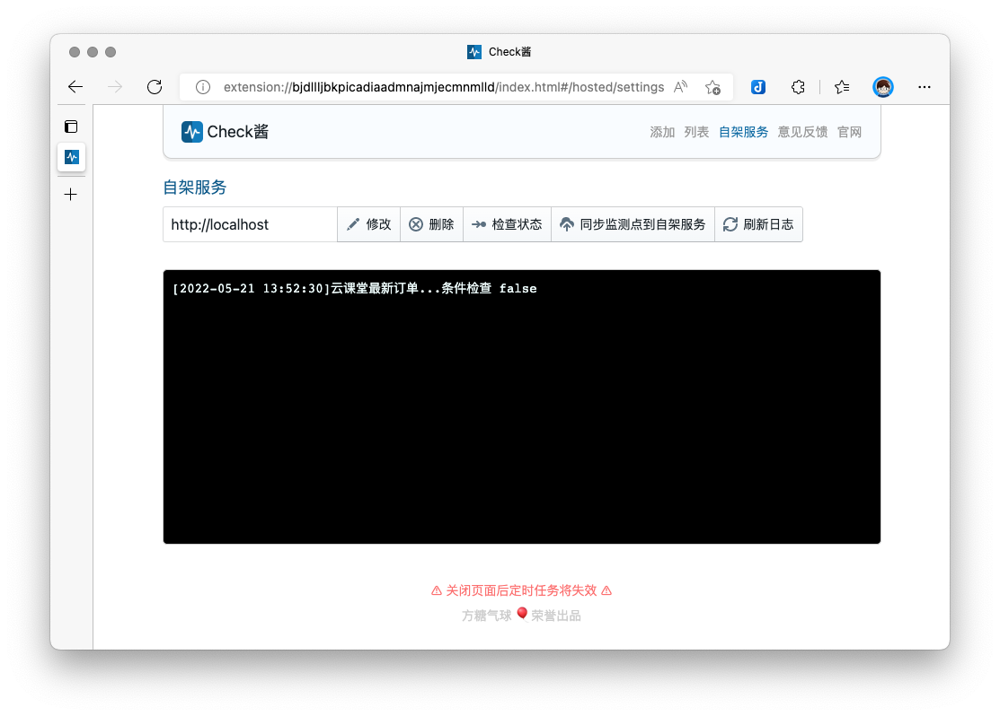
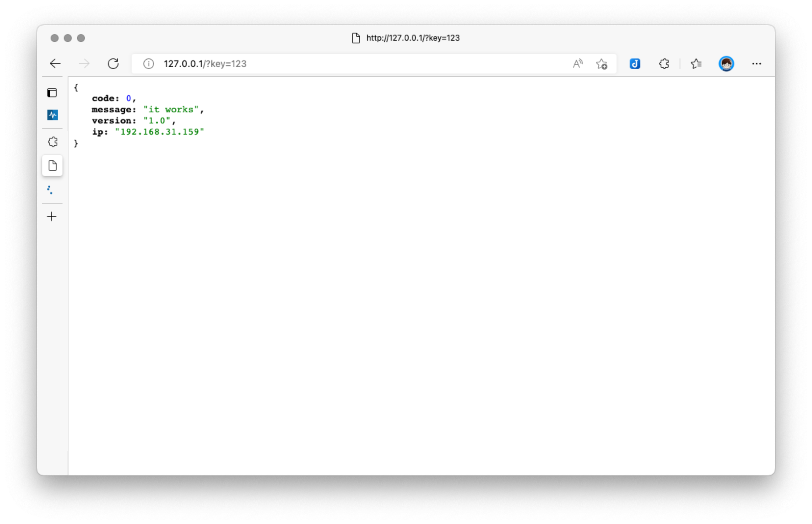
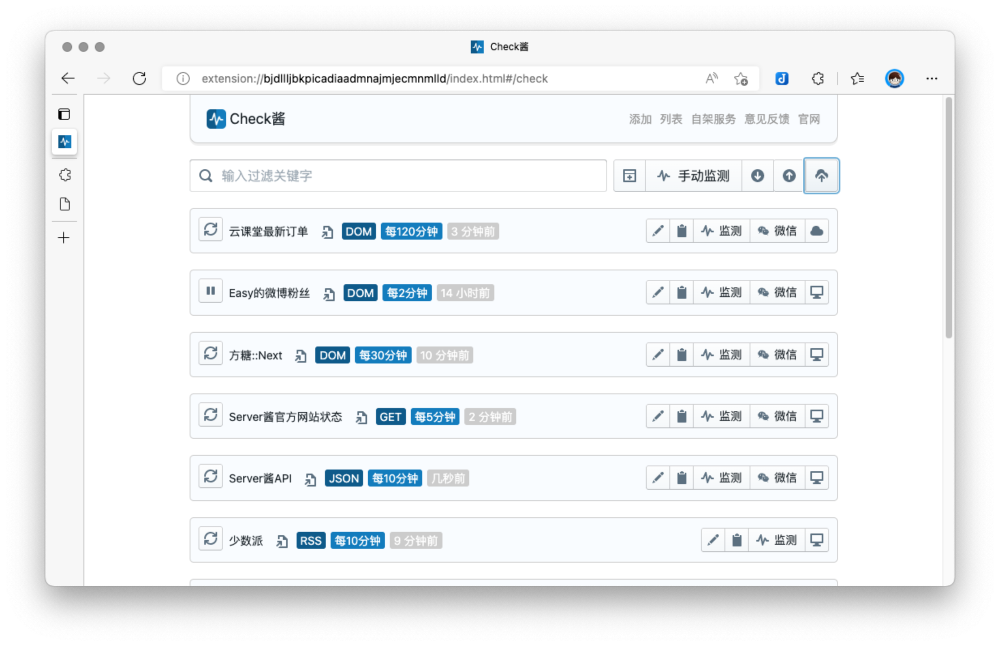
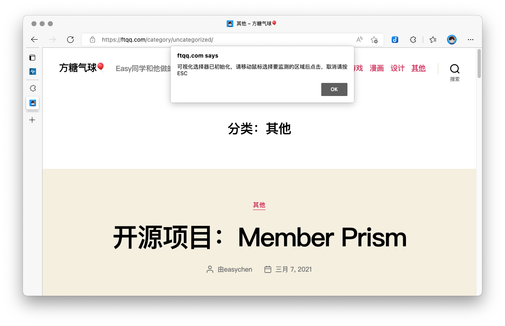
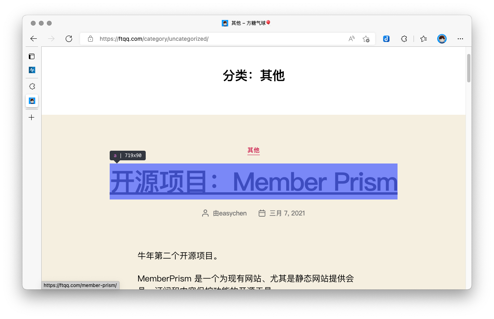
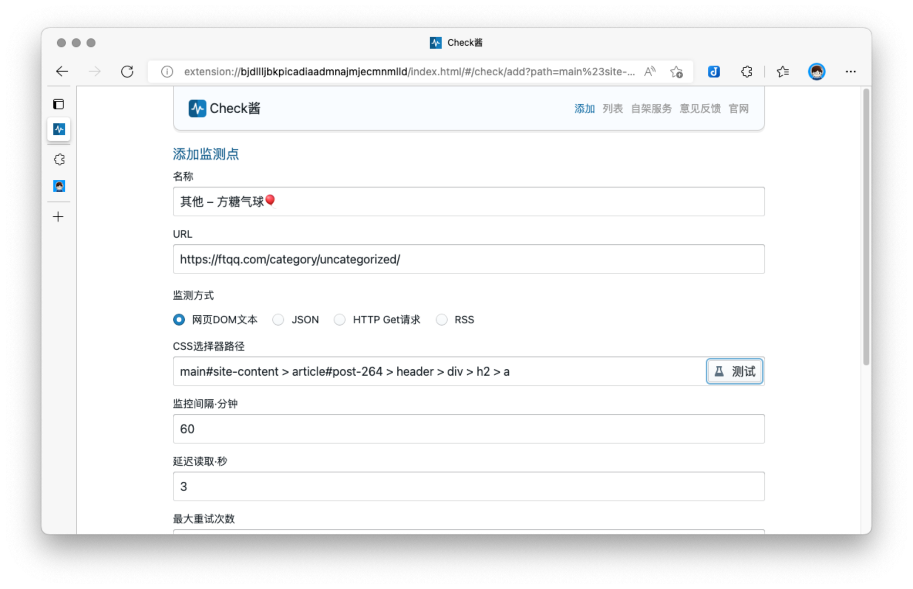
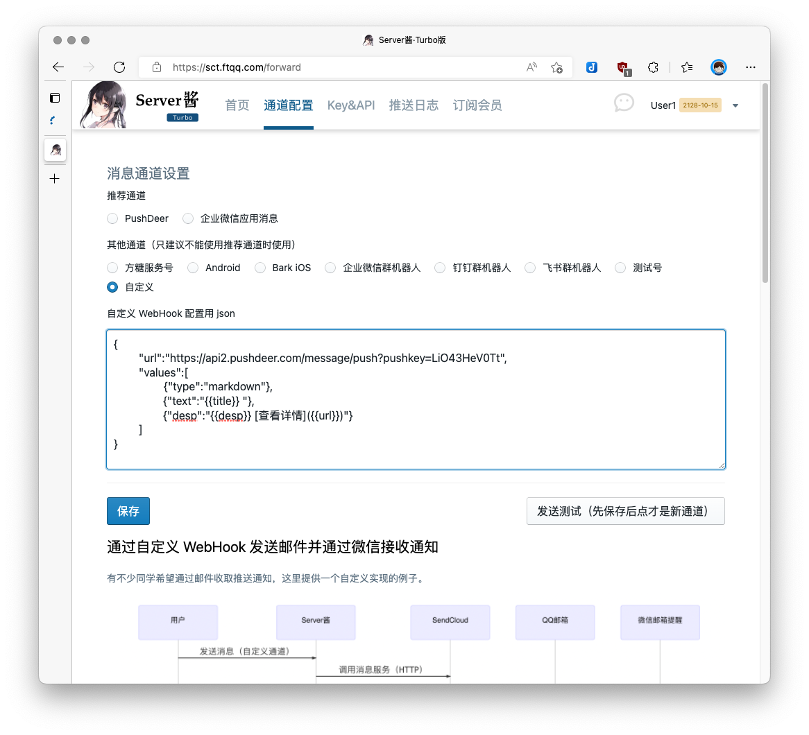

# Check酱

**监测网页内容变化，并发送异动到微信**

> ⚠️ 此仓库用于文档、插件和镜像下载、以及issue跟踪

## TLDR版

- Chrome/Edge浏览器插件：[下载](ckc.zip)
- 自架版云端 Docker 命令（`API Key`为`YouRAPiK1`）:

```bash
docker run -e API_KEY=YouRAPiK1 -e TZ=Asia/Chongqing -p 8088:80 -v $PWD:/data -d ccr.ccs.tencentyun.com/ftqq/checkchan:latest
```
特别提醒：`/data`挂载的目录需要写权限


## 什么是「Check酱」

 

Check酱是方糖气球出品的网页内容监测工具，它包含一个Edge/Chrome**浏览器插件**和可以自行架设的**云端**。

基于浏览器插件，它通过**可视化选择器**理论上可以监控网页上的任意内容（文本）、除了浏览器通知，还可以配合[Server酱](https://sct.ftqq.com)将异动推送到微信或手机。

  

Check酱插件通过后台打开网页的方式进行监测，**完全模拟用户的真实行为**，可以监控需要登录的各种后台网页，并自动延续登录状态。

除了支持网页内容（Dom）的监测，还支持HTTP状态（通过GET监测）、JSON和RSS方式。

  

配合可以自行架设的**云端**，可以将监测任务同步到服务器，这样当浏览器和电脑关掉以后，监测任务依然可以定时运行。

  

## 安装

### 插件安装

> 目前Check酱正在内测，尚未上架Edge商店，只能通过手工方式载入

下载[插件ZIP包](ckc.zip)，解压为目录（后文称其为A）。

打开Edge的插件页面，点击「Load Unpacked」，选择上边解压得到的目录A。

  

成功载入的话，就可以看到Check酱界面了。如果失败，通常是因为解压时多了一层目录导致的，可以试试重新选择A目录的下一级目录

### 自架云端安装

> 架设自架版云端需要技术基础，非技术用户建议购买我们的官方版云端（将在内测完成后发布）

为方便安装，自架版云端需要docker环境。如果你没有云服务器，可以看看[腾讯云30~50元首单的特价服务器](https://curl.qcloud.com/VPjlS4gj)。

#### 通过 Docker-compose 启动

登录服务器（假设其IP为IPB），在要安装的目录下，新建一个 `docker-compose.yml` 文件，复制张贴下边的内容：

```yaml
version: '2'
services:
  api:
    image: ccr.ccs.tencentyun.com/ftqq/checkchan:latest
    volumes:
      - './:/data'
    ports:
      - '8088:80'
    environment:
      - API_KEY=<这里写一个你自己想的API_KEY>
      - TZ=Asia/Chongqing
```

将其中 `<这里写一个你自己想的API_KEY>` 换成一个别人不知道的密码（下文称密码C
）。注意不要包含`$`字符，替换完后也不再有两边的尖括号`<>`。

保证Docker用户对此目录有写权限，并在同一目录下运行以下命令：

```bash
docker-compose up -d
```

> 如提示docker服务未安装/找不到/未启动，可在 docker-compose 前加 sudo 再试

等待初始化完成后，访问 `http://$BBB:8088?key=$CCC`( 将$BBB替换为IP B，$CCC替换为密码C )，看到包含 `it works` 的提示即为架设成功。

 

#### 通过 Docker 启动

```bash
docker run -e API_KEY=* -e TZ=Asia/Chongqing -p 8088:80 -v $PWD:/data -d ccr.ccs.tencentyun.com/ftqq/checkchan:latest
```

请将上述命令中的*替换为对应的数据库信息。

### 将浏览器插件对接云端

 

点击插件右上方菜单中的`自架服务`。

在`服务器地址`一栏输入 `http://$BBB:8088?key=$CCC`( 将$BBB替换为IP B，$CCC替换为密码C )；在`API_KEY`一栏输入密码C。

点击保存，连接成功后，配置完成。

### 同步本地任务到云端

配置好云端以后回到列表页，每行最右边会多出来一个「电脑」图标，点击后会变成「云」图标，该任务将改为在云端执行。

  

点击右上角 「云+箭头」的按钮，可以主动同步任务到云端。

 

## 使用

### 添加网页监控点

安装插件后，打开要监控的网页，在网页上点击右键，可以看到「定位监测对象」一项。

 

点击后，开始初始化可视化选择器。

  

移动鼠标可以看到高亮区域，放到要监控的文字上点击鼠标左键。

  

将转向到添加页面。

  

可以修改名称、设置监控间隔时间、延迟、最大重试次数。在保存之前，最好点击`CSS选择器路径`一栏后的`测试`按钮进行测试。

如果提示「检测内容为空」，说明存在问题。再次点击进行观察：

如果发现页面打开后favicon没有出来就关了，可以增加「延迟读取」的秒数；如果打开后还是返回空，那么刚才自动生成的选择器路径可能不正确。

可以更换为浏览器自动生成的，方法如下：

① 在要检测的文本上点右键，选择「inspect/审查元素」

  

② 这时候会自动打开开发者工具，并自动选中源码中元素的对应行。在高亮的行上点击右键，选择「复制/Copy」→ 「复制选择器/Copy selector」

  

③ 将复制到的剪贴板的路径填入到「CSS选择器路径」一行后，再次点击「测试」按钮进行测试。

测试通过后，点击「提交」保存监测点。

### 通过Server酱推送到微信和其他设备

  

在添加和修改监测点时，填入Sendkey即可将消息推送到Server酱。

#### 如何获得 SendKey

登录[Server酱官网](https://sct.ftqq.com)，进入「[Key&API](https://sct.ftqq.com/sendkey)」，点击「复制」按钮即可。

  

#### 如何推送到其他通道

登录[Server酱官网](https://sct.ftqq.com)，进入「[通道配置](https://sct.ftqq.com/forward)」，选择要推送的通道，并按页面上的说明进行配置。可以将消息推送到「PushDeer」和各种群机器人。

  

如果以上通道不能满足你的需要，可以选择「自定义」通道，发送自定义的http请求。此方式可以兼容绝大部分通知接口。

  
